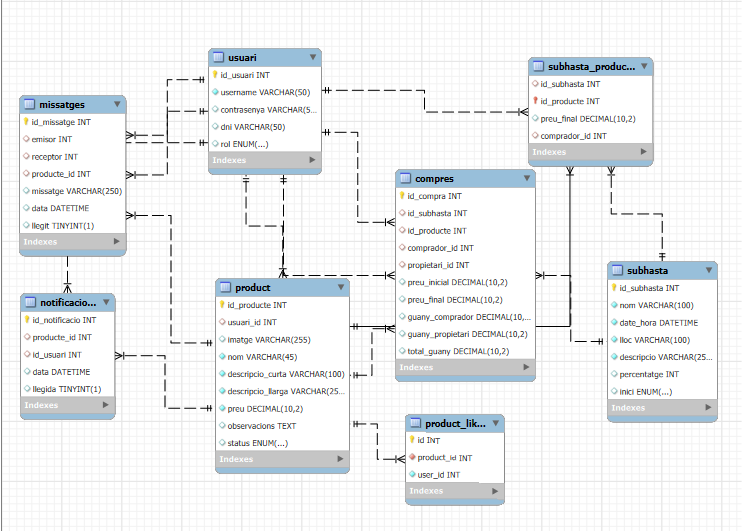

= TopBid

== Introducció
=== Descripció dels membres de l’equip de treball
L’equip de treball d’aquesta aplicació és compost per Pol i Juan, dos alumnes amb experiència en el desenvolupament d’aplicacions i la gestió de bases de dades. Junts, hem treballat per dissenyar i implementar una plataforma funcional que facilita la compra i venda a través de subhastes físiques.

Durant el desenvolupament del projecte, hem establert una connexió eficient amb la base de dades mitjançant PHP i PDO (PHP Data Objects), garantint la seguretat i la gestió òptima de les dades de l'usuari i dels productes. Hem utilitzat JavaScript per a la interactivitat de la plataforma i per millorar l'experiència de l'usuari, assegurant que els elements de la pàgina siguin dinàmics i responguin a les necessitats dels usuaris en temps real.

El nostre enfocament en el disseny de la plataforma segueix el patró Model-Vista-Controlador (MVC), oferint una estructura neta i escalable per a la gestió de les subhastes. Així, hem aconseguit crear una aplicació que és fàcil de mantenir.

En resum, el nostre compromís és proporcionar una possible expansió i una experiència d’usuari fluida per a la compra i venda a través de subhastes.

<<<
== Descripció de l'objectiu de l’aplicació

L'objectiu principal és crear una plataforma digital que complementi les subhastes físiques, oferint un espai en línia on venedors i subhastadors puguin gestionar i interactuar amb els productes i les subhastes de manera eficient. La plataforma es divideix en dos tipus d'usuaris: els subhastadors i els venedors, cadascun amb els seus respectius entorns i funcionalitats adaptades a les seves necessitats.

=== Per al subhastador:
* **Gestió de productes:** Visualitzar, editar i validar productes.
* **Creació i gestió de subhastes:** Crear subhastes, assignar productes, i gestionar sessions.
* **Assignació de guanyadors:** Assignar compradors guanyadors i crear comptes nous si cal.
* **Resum de comptes:** Revisió de subhastes, transaccions, i pagaments pendents.

=== Per al venedor:
* **Creació de productes:** Introduir productes que seran revisats pel subhastador.
Per al venedor:
* **Creació de productes:** Introduir productes que seran revisats pel subhastador.
* **Notificacions d'estat:** Rebre actualitzacions sobre els productes.
* **Interacció amb productes:** Fer "m'agrada" i seguir productes.
* **Visualització de subhastes:** Veure subhastes actives i els seus productes.

=== Per a l'usuari no registrat:
* Exploració oberta de productes i subhastes programades. En el futur, aquests usuaris podran fer "m'agrada" a productes si decideixen registrar-se.

=== Target (públic objectiu)

L'objectiu principal de la plataforma és facilitar la compra i venda a través de subhastes, per la qual cosa el públic objectiu són els subhastadors interessats, així com els usuaris que busquen productes únics i interessants a preus competitius. La plataforma està dissenyada per a persones que volen vendre o comprar productes de manera eficient.

<<<
== Disseny

=== Disseny de base de dades amb el model Entitat-Relació

La nostra base de dades segueix un model Entitat-Relació (ER) que ens permet gestionar de manera eficient les dades dels usuaris, els productes i les subhastes. A continuació, es mostra el diagrama ER de la base de dades:

[Diagrama ER de la base de dades]

**PRODUCTES**([underline]##id_producte##, nom, descripcio_curta, descripcio_llarga, imatge, preu, observacions, status, usuari_id) +
**SUBHASTES**([underline]##id_subhasta##, nom, date_hora, lloc, descripcio, percentatge, inici) +
**USUARIS**([underline]##id_usuari##, username, contrasenya, dni, rol) +
**PRODUCT_LIKES**([underline]##id##, product_id, user_id) +
**SUBHASTA_PRODUCTE**([underline]##id_producte##, id_subhasta, preu_final, comprador_id) +
**NOTIFICACIONS**([underline]##id_notificacio##, producte_id, id_usuari, data, llegida) +
**MISSATGES**([underline]##id_missatge##, emisor, receptor, producte_id, missatge, data, llegit) +
**COMPRES**([underline]##id_compra##, id_subhasta, id_producte, comprador_id, propietari_id, preu_inicial, preu_final, guany_comprador, guany_propietari, total_guany)

<<<
=== La guia d’estils, l’mockup d’interfícies, etcètera

Per a la creació de la interfície gràfica de la plataforma, vam utilitzar un disseny minimalista i funcional que facilita la navegació i l'ús de la plataforma. Ens vam centrar en la simplicitat i la claredat de la interfície per garantir una experiència d'usuari intuïtiva i agradable.

A continuació, hi haura un enllaç a la guia d’estils feta amb la plataforma de Figma.:

link:https://www.figma.com/design/urapGVOc4Ef6UrZS0PQMXG/Guida-d'estils-TopBid?node-id=0-1&t=4VxWumxWGPBjaNUX-1[Guia d’estils]

== Manuals

=== Manual d’instal·lació

Per a instal·lar l'aplicació TopBid, em fet un manual amb tots els passos necessaris per configurar el servidor, la base de dades i l'aplicació. Aquest manual inclou instruccions detallades per a la instal·lació de les dependències, la configuració del servidor, i la importació de la base de dades.

link:https://gitlab.com/subhasta/subhasta10/-/blob/develop/public/docs/manualServidor.adoc?ref_type=heads[Manual d’instal·lació]

<<<
== Planificació i desviacions en la planificació
Vam utilitzar GitLab, una plataforma que ens va permetre gestionar les tasques de manera eficient i organitzada. GitLab va ser útil per mantenir una bona visibilitat de tot el procés de desenvolupament i per assegurar-nos que cada etapa es completés de manera ordenada.

A través de GitLab Issues, vam desglossar el projecte en tasques més petites i manejables. Aquestes tasques es van dividir en diferents etapes o categories, com *Todo*, *Design*, *Doing*, *Preview*, i *Done*, cosa que ens permet visualitzar fàcilment l'estat de cada element del projecte. A mesura que avançàvem, movíem les tasques de la secció Doing a Preview quan estaven a punt de ser revisades, i finalment a Done quan estaven completades i aprovades.

Una altra pràctica important que vam implementar va ser la creació d’una nova branca cada vegada que iniciàvem una tasca nova. Això ens va permetre treballar de manera independent en diferents aspectes del projecte sense interferir amb el codi principal. Un cop una tasca es completava, uníem aquesta branca a la nostra branca principal anomenada *develop*, assegurant-nos que tot el codi fos revisat i integrat de manera segura i sense conflictes.

Pel que fa a la comunicació, la vam fer de manera verbal, ja que els dos treballàvem junts de manera presencial en classe. Aquesta dinàmica va facilitar una comunicació fluida i contínua. Podíem parlar en temps real sobre les decisions tècniques, resoldre dubtes immediatament i ajustar la nostra estratègia quan sorgien imprevistos.

No obstant això, malgrat la bona organització i l'ús de les eines adequades, vam tenir algunes desviacions importants en la planificació, sobretot en els primers moments del projecte. Un d'aquests imprevistos va ser la sortida d’un dels membres de l’equip. Inicialment, l’equip estava format per tres persones, però per motius personals, un dels membres va haver de deixar el projecte durant la primera setmana. Aquesta va ser una situació difícil per a nosaltres, ja que ens vam adonar que havíem de fer front al treball amb dos membres en comptes de tres, cosa que va suposar una càrrega extra.

En resum, la planificació a través de GitLab ens va permetre gestionar el projecte de manera organitzada, però també vam haver de ser flexibles i adaptatius quan van sorgir imprevistos. La bona comunicació entre nosaltres va ser clau per afrontar les desviacions i mantenir-nos alineats en els objectius del projecte.

<<<
== Línies futures

Per a les línies futures, tenim diverses idees per millorar i ampliar la plataforma TopBid. Algunes de les nostres propostes inclouen:

* **Chat amb usuaris**
- Implementar un sistema de missatgeria en temps real que permeti la interacció entre usuaris i subhastadors.

* **Wallet (Cartera)**
- Crear una cartera digital integrada on els usuaris puguin emmagatzemar fons per a futures compres.
- Integrar mètodes de pagament populars, com targetes de crèdit, PayPal o criptomonedes.
- Oferir un historial de transaccions detallat i opcions de seguretat com l'autenticació de dos factors.

* **Agenda**
- Afegir una agenda a la plataforma on els usuaris puguin veure i programar esdeveniments de subhasta, amb recordatoris i notificacions.
- Integració amb calendaris externs (per exemple, Google Calendar) per rebre recordatoris en altres dispositius.

* **Descarregar Factures**
- Permetre que els usuaris descarreguin factures en format PDF, amb detalls clars de cada transacció.
- Implementar un sistema de facturació automàtic que enviï les factures per correu electrònic després de cada transacció important.

* **Inici de Sessió amb Google**
- Integrar l'opció d'inici de sessió amb Google per a una autenticació ràpida i segura.
- Considerar la possibilitat d'afegir inici de sessió també amb xarxes socials com Facebook o Apple.

* **Likes sense Registrar-se**
- Implementar una opció perquè els visitants puguin donar "m'agrada" a subhastes o articles sense necessitat d'estar registrats.
- Comptabilitzar els “m'agrada” anònims i oferir l'opció de registre perquè els usuaris puguin guardar els seus interessos i personalitzar la seva experiència.

* **Estadístiques d'Usuari per a Subhastadors**
- Proporcionar als subhastadors un panell de dades sobre l'activitat dels seus articles: visualitzacions i “m'agrada”.
- Incloure gràfics i informes detallats.

* **Millores en la Interfície d'Usuari**
- Redissenyar pàgines per millorar la usabilitat tant en dispositius mòbils com d'escriptori.

<<<
== Conclusions

=== Pol

En conclusió, estic molt satisfet amb el treball realitzat.Ha estat molt bona experiència tant a nivell tècnic com personal, i crec que he après molt durant el procés. 

=== Juan
En conclusió, tot i els diversos problemes que hem tingut durant el desenvolupament d’aquesta aplicació, estic realment satisfet amb el procés i amb el resultat final. Malgrat les dificultats inicials, com va ser la reducció de l'equip i els imprevistos que van sorgir, em sento orgullós de la feina que hem fet. Ha sigut una experiència molt bona, tant en l'àmbit tècnic com personal, i crec que he crescut com a professional en el camí.

He gaudit de la col·laboració amb Pol, de la capacitat d’adaptar-nos ràpidament als canvis i de la manera en què hem sabut gestionar els reptes a mesura que sorgien. Em sento satisfet de com hem aconseguit mantenir una bona organització, treballant de manera eficient i de manera flexible per complir els objectius del projecte. A més, la creació d’una plataforma funcional i ben estructurada em fa sentir que l’esforç ha valgut la pena.

També penso que, en el futur, seria positiu revisar la manera en què es formen els grups. Des de la meva perspectiva, amb un equip més equilibrat podríem haver aconseguit encara més coses.

=== Aportacions del projecte als coneixements de l’alumne
=== Pol

Amb aquest projecte he après nous llenguatges de programació com PHP i JavaScript, reforçant els meus coneixements previs en HTML, CSS i SQL.
A la part de servidor he reforçat els meus coneixements en la configuració d’un servidor Debian, així com en la instal·lació i configuració de serveis com Apache, MySQL i PHP que ja vaig aprendre en el cicle de SMIX.

=== Juan
He pogut aplicar i reforçar alguns conceptes que ja havia après prèviament en el cicle de DAM, però aquest projecte m'ha permès consolidar i incrementar els meus coneixements en diverses àrees. He après a utilitzar i comprendre en profunditat el funcionament de PHP, així com a fer un bon ús del `display: flex` amb l’eina de CSS, cosa que ha millorat la meva capacitat per crear dissenys responsius i estructurats.

A més, aquest projecte m'ha ajudat a consolidar els coneixements adquirits en el grau mitjà pel que fa a la configuració d'un servidor en Debian i l'ús de JavaScript. Aquesta experiència pràctica m'ha donat una millor comprensió i confiança per afrontar futurs projectes amb tecnologies similars.

<<<
== Glossari
Glossari de termes utilitzats en el projecte.

* **PHP** (Hypertext Preprocessor): Llenguatge de programació del costat del servidor utilitzat per al desenvolupament web per crear pàgines dinàmiques i interactuar amb bases de dades.
* **CSS** (Cascading Style Sheets): Llenguatge utilitzat per donar estil i disseny a les pàgines web. Permet definir colors, fonts, marges, i estructures de manera que els llocs web siguin visualment atractius i responsius.
* **Display:** flex: Propietat CSS que facilita la creació de dissenys flexibles i responsius, distribuint els elements dins d’un contenidor de manera adaptable.
Debian: Sistema operatiu basat en Linux molt utilitzat per configurar servidors web per la seva estabilitat i seguretat.
* **JavaScript:** Llenguatge de programació orientat al client que permet donar funcionalitat i interactivitat a les pàgines web, com ara animacions i validacions de formularis.
* **SQL** (Structured Query Language): Llenguatge estàndard per gestionar i manipular bases de dades. Permet crear, modificar, i consultar dades en bases de dades relacionals.
Apache: Servidor web de codi obert molt utilitzat per allotjar aplicacions web. Permet la configuració de servidors HTTP, fent que els llocs web siguin accessibles als usuaris.
* **SSH** (Secure Shell): Protocol de xarxa que permet la connexió remota segura a un servidor o ordinador, utilitzat per gestionar i configurar sistemes de forma remota amb seguretat criptogràfica.
* **Gitlab** Plataforma de desenvolupament de programari que ofereix eines per gestionar projectes, control de versions, i col·laboració en equip. Permet als desenvolupadors treballar junts de manera eficient i organitzada.

<<<
== Webgrafia
Llista de recursos web consultats.

Pel servidor

https://docs.vultr.com/how-to-install-mysql-on-debian-12

https://stackoverflow.com/questions/62240102/php-warning-php-startup-unable-to-load-dynamic-library-pdo-mysql-so

A la view de subhastes de la pagina principal m’he inspirat en aixó.
https://codepen.io/fajarnurwahid/pen/VwyjLRz

Com a pàgina principal em vaig inspirar en milanuncios
https://www.milanuncios.com/

